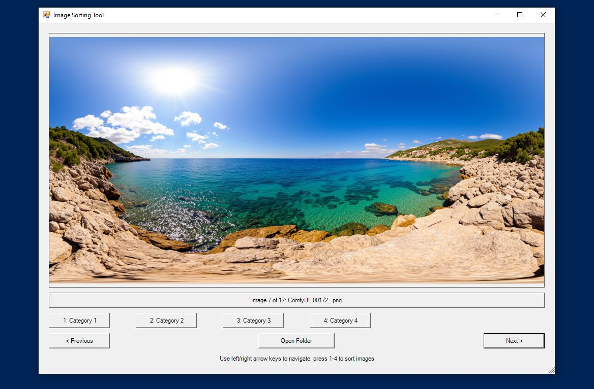
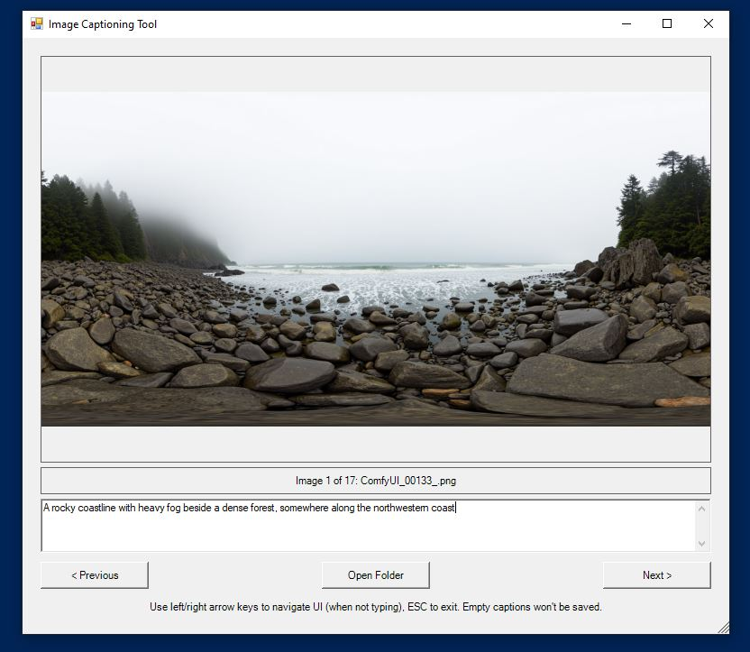
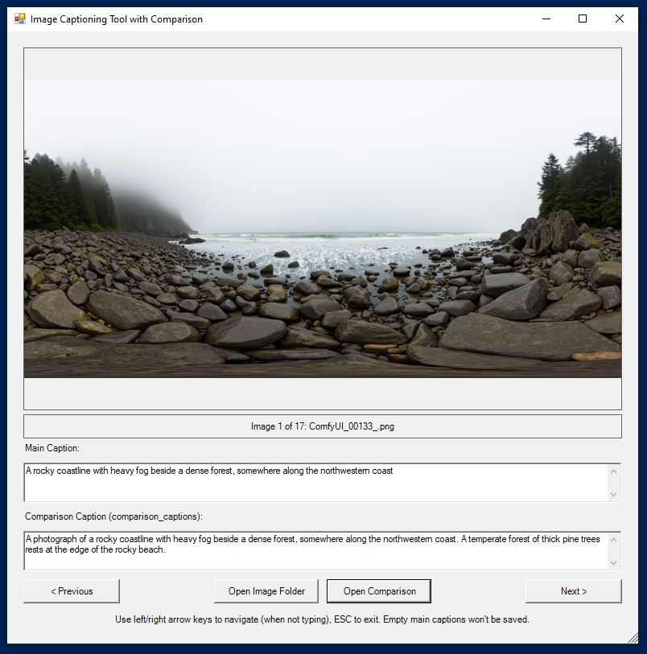

# 🧰 PowerShell Dataset Tools

A collection of PowerShell GUI scripts for manually working with datasets, including tools for sorting and captioning image files. Built to support efficient manual workflows in dataset curation and research contexts.


## 🖼️ PowerShell Image Sorting Tool



A fast and intuitive PowerShell-based image sorting tool for quickly organizing photos into predefined categories using your keyboard. Meant for manual sorting tasks where automation isn’t feasible — just press 1–4 to send an image to its corresponding folder, or skip it to leave it in place.

---

### ✨ Features

- 📂 Quickly sort images into 4 custom category folders
- ⌨️ Keyboard shortcuts: `←` / `→` to navigate the UI, `1–4` to sort  
   - `Enter` activates the currently focused button (e.g., Previous/Next) for faster keyboard navigation
- 🖱️ Click-based UI with resizable controls
- 🖼️ Full image preview with zoom-to-fit
- 📁 Auto-creates category subfolders inside the selected folder

---

### 🚀 Getting Started

#### 🧾 Requirements

- Windows with PowerShell (tested on PowerShell 5.1)
- .NET Framework (for `System.Windows.Forms` and `System.Drawing`)

---

#### 🛠️ Usage

1. Clone this repo or download the `.ps1` script.

2. Run the script in PowerShell by right clicking on it and selecting 'Run with PowerShell' or by entering the following command like this:
   ```powershell
   .\ImageSortingTool.ps1
   ```

3. Select a folder with images that have a .jpg, .jpeg, .png, .gif, or .bmp extension.

4. Start sorting images


## 🏷️ PowerShell Image Captioning Tool

A companion tool to the sorting script, this PowerShell GUI helps you view, create, and edit image captions stored in individual `.txt` files.



---

### ✨ Features

- 🖼️ Displays images alongside editable captions
- 📝 Edit and save captions to `.txt` files
- 📁 Captions are read from and saved to files in the format of `<image_name.extension>.txt`

---

### 🚀 Getting Started

#### 🧾 Requirements

- Windows with PowerShell (tested on PowerShell 5.1)
- .NET Framework (for `System.Windows.Forms` and `System.Drawing`)

---

#### 🛠️ Usage

1. Clone this repo or download the `.ps1` script.

2. Run the script in PowerShell by right clicking on it and selecting 'Run with PowerShell' or by entering the following command like this:
   ```powershell
   .\ImageCaptioningTool.ps1
   ```

3. Select a folder containing images.

4. Begin editing captions.


## 🏷️ PowerShell Image Captioning Comparison Tool



An modified version of companion tool to the sorting script, this PowerShell GUI helps you view, create, and edit image captions stored in individual `.txt` files, alongside a second set of matching caption filenames in a separate directory.

This script is useful when you compare the quality of different captions for the same image, for each image in your dataset.

---

### ✨ Features

- 🖼️ Displays images alongside editable captions
- 📝 Edit and save captions to `.txt` files
- 📁 Captions are read from and saved to files in the format of `<image_name.extension>.txt`

---

### 🚀 Getting Started

#### 🧾 Requirements

- Windows with PowerShell (tested on PowerShell 5.1)
- .NET Framework (for `System.Windows.Forms` and `System.Drawing`)

---

#### 🛠️ Usage

1. Clone this repo or download the `.ps1` script.

2. Run the script in PowerShell by right clicking on it and selecting 'Run with PowerShell' or by entering the following command like this:
   ```powershell
   .\ImageCaptioningCompareTool.ps1
   ```

3. Select a folder containing images alongside captions in txt files.

4. Select a second folder containing a second set of txt file captions.

5. Begin editing captions.
